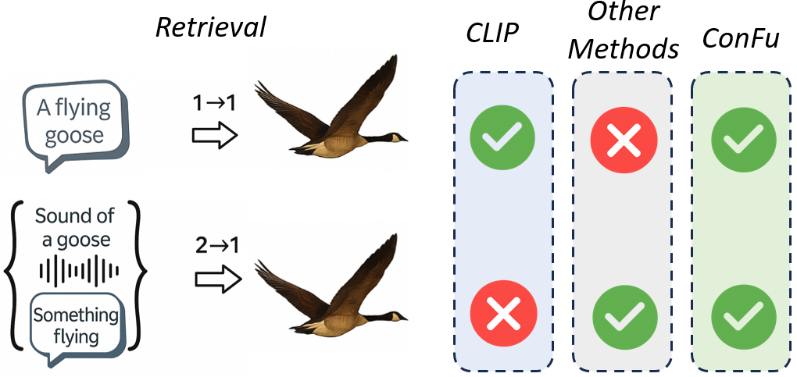

# ConFu: Contrastive Fusion for Higher-Order Multimodal Alignment
<p align="center">
  
</p>
**The More, the Merrier: Contrastive Fusion for Higher-Order Multimodal Alignment**  
Accepted at **CVPR 2026**

📄 Paper: https://arxiv.org/abs/2511.21331  
🌐 Project Page: https://estafons.github.io/confu/  
💻 Code: https://github.com/estafons/confu

---

## Repository Status

⚠️ **This repository is currently under active development.**

- Code and scripts are being cleaned and documented.
- Additional utilities and configuration files will be added.
- The **Bird-MML dataset link will be released soon**.

---

# Installation

## Prerequisites

1. conda (or other package manager)
2. install requirements (environment.yaml)
```
conda env create -f environment.yaml
```
3. activate environment
```
conda activate contrastive_fusion
```
4. Run experiments!

### data proposed folder structure
```
src/
data/
└── avmnist
    ├── audio
    │   ├── test_data.npy
    │   └── train_data.npy
    ├── image
    │   ├── test_data.npy
    │   └── train_data.npy
    ├── test_labels.npy
    └── train_labels.npy
└── multibench
    ├── humor.pkl
    ├── im.pkl
    ├── mosei_senti_data.pkl
    ├── mosi_data.pkl
    └── sarcasm.pkl
└── birds_mml_csvs
    ├── taxa_ssw60_vb100_all.csv
    ├── taxa.csv
└── CUB_200_2011
    ├── ..
└── birds_mml_csvs
    ├── taxa_ssw60_vb100_all.csv
    ├── taxa.csv
└── ssw60
    ├── audio_ml
    │   ├── ..
    ├── images_inat
    │   ├── ..
    ├── images_nabirds
    │   ├── ..
    ├── video_ml
    │   ├── ..
    ├── audio_ml.csv
    ├── images_inat.csv
    ├── images_nabirds.csv
    ├── video_ml.csv
    └── ..
└── vb100
    ├── vb100_all_videos
    │   ├── ..
    ├── vb100_annotations_v1
    │   ├── ..
    ├── vb100_audio
    │   ├── ..
    ├── vb100_taxonomy
    │   ├── ..
```


# Experiments

### MULTIBENCH

Each experiment was repeated for **5 runs**, and the **mean** and **standard deviation** were computed.

1. **Install the required dependencies.**
2. **Download the dataset** from the MultiBench repository:  
   https://github.com/pliang279/MultiBench
3. **Set the `results_path`** in your Hydra configuration (`config.yaml`).  
   This determines where intermediate CSV results will be stored.  
   Example:
   ```yaml
   results_path: ${oc.env:HOME}/contrastive_fusion/results/
4. **Run the script**
```
bash scripts/multibench.sh
```


## AV-MNIST

Experiments were repeated for **5 runs**, and the **mean** and **standard deviation** were computed.

1. **Download the dataset:**  
   https://github.com/pliang279/MultiBench?tab=readme-ov-file#multimedia
2. **Configure the results and data paths** in the Hydra config (`av_mnist.yaml`).
3. **Run the experiment script:**
   ```bash
   bash scripts/av_mnist.sh
    ```

## SSW60, VB100, CUB200

**NOTE**: Training from scratch requires approximately **1–2 days** on a single GPU.

1. **Install the required dependencies.**
2. **Download the evaluation datasets:**  
   - SSW60: https://github.com/visipedia/ssw60  
   - VB100: https://arma.sourceforge.net/vb100/
3. **Download a pretrained model**, or download the training data and **train the model** yourself.
4. **Configure the data and model paths** in `configs/birds.yaml`.
5. **Run the training and evaluation scripts:**
   ```bash
   bash scripts/birds_mml_train.sh
   bash scripts/bird_zero_shot.sh
   bash scripts/birds_few_shot.sh
   ```


## Example code - illustration of method

```python

class ConFu(pl.LightningModule):
    """
    Minimal illustration of the ConFu architecture.

    Key ideas:
    - Three encoded modalities: M1, M2, M3.
    - Three injected fusion modules: fusion12, fusion13, fusion23.
      (Each receives concatenated embeddings from two modalities.)
    - Encoders and fusion modules can be ANY nn.Module as long as their
      input/output dimensions align.
    - InfoNCE is used to compute contrastive losses between:
        (a) single-modality embeddings
        (b) fused embeddings and the remaining modality
    """

    def __init__(
        self,
        encoder1,               # encoder for modality 1
        encoder2,               # encoder for modality 2
        encoder3,               # encoder for modality 3
        fusion12,               # fusion module for (1,2)
        fusion13,               # fusion module for (1,3)
        fusion23,               # fusion module for (2,3)
        embed_dim=128,          # shared embedding dimension
    ):
        super().__init__()

        # --------------------------------------------------------------
        # Encoders (injected)
        # --------------------------------------------------------------
        self.encoder1 = encoder1
        self.encoder2 = encoder2
        self.encoder3 = encoder3

        # --------------------------------------------------------------
        # Fusion modules (injected)
        # Each fusion module computes:
        #    fused_ij = f_ij([e_i || e_j])
        # --------------------------------------------------------------
        self.fusion12 = fusion12
        self.fusion13 = fusion13
        self.fusion23 = fusion23

        # --------------------------------------------------------------
        # Projection into shared embedding space
        # --------------------------------------------------------------
        self.proj1 = nn.Linear(encoder1.output_dim, embed_dim)
        self.proj2 = nn.Linear(encoder2.output_dim, embed_dim)
        self.proj3 = nn.Linear(encoder3.output_dim, embed_dim)

    def forward(self, x1, x2, x3):
        """
        1. Encode each modality separately.
        2. Project each into a shared embedding space.
        3. Concatenate pairs and pass them through the corresponding fusion module.

        Returns:
            z12, z13, z23  : fused embeddings
            z1, z2, z3     : single-modality projected embeddings
        """

        # ------------------------
        # Encode modalities
        # ------------------------
        e1 = self.encoder1(x1)
        e2 = self.encoder2(x2)
        e3 = self.encoder3(x3)

        # ------------------------
        # Project to shared space
        # ------------------------
        z1 = F.normalize(self.proj1(e1), dim=-1)
        z2 = F.normalize(self.proj2(e2), dim=-1)
        z3 = F.normalize(self.proj3(e3), dim=-1)

        # ------------------------
        # Fused representations
        # Each fusion block receives a concatenation of two encodings
        # ------------------------
        z12 = F.normalize(self.fusion12(torch.cat([e1, e2], dim=-1)), dim=-1)
        z13 = F.normalize(self.fusion13(torch.cat([e1, e3], dim=-1)), dim=-1)
        z23 = F.normalize(self.fusion23(torch.cat([e2, e3], dim=-1)), dim=-1)

        return z12, z13, z23, z1, z2, z3

    def training_step(self, batch, batch_idx):
        """
        Minimal example of how losses are computed.
        Actual training logic is intentionally simplified.
        """
        x1, x2, x3 = batch

        z12, z13, z23, z1, z2, z3 = self(x1, x2, x3)

        # ------------------------
        # Single-modality losses
        # ------------------------
        l12 = infonce(z1, z2)
        l23 = infonce(z2, z3)
        l31 = infonce(z3, z1)

        # ------------------------
        # Fusion-to-modality losses
        # ------------------------
        lf12 = infonce(z12, z3)
        lf13 = infonce(z13, z2)
        lf23 = infonce(z23, z1)

        # Simple uniform average
        loss = (l12 + l23 + l31 + lf12 + lf13 + lf23) / 6

        return loss
```

# Citation

```bibtex
@article{koutoupis2025more,
  title={The More, the Merrier: Contrastive Fusion for Higher-Order Multimodal Alignment},
  author={Koutoupis, Stefanos and Zervou, Michaela Areti and Kontras, Konstantinos and De Vos, Maarten and Tsakalides, Panagiotis and Tsagatakis, Grigorios},
  journal={arXiv preprint arXiv:2511.21331},
  year={2025}
}
```